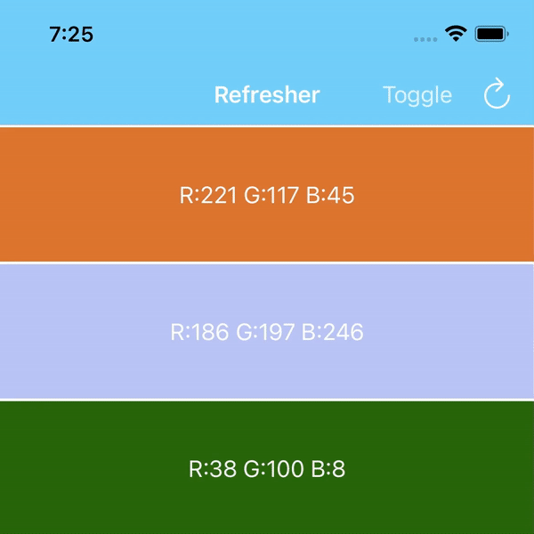

# Refresher

Refresher is a pull-to-refresh component that can customize animation according to the pull-down state.
The core code comes from [MJRefresh](https://github.com/CoderMJLee/MJRefresh) and [PullToRefresh](https://github.com/Yalantis/PullToRefresh).



## Requirements
- iOS 11.0+
- Swift 5.0+


## Installation

### [CocoaPods](https://cocoapods.org)

```ruby
use_frameworks!
pod 'Refresher_Swift'
```

## Usage

### Quick Start

```swift
import Refresher_Swift

class MyViewController: UICollectionViewController {
    override func viewDidLoad() {
        super.viewDidLoad()

        // pull-down refresh
        collectionView.topRefresher = Refresher {
            // fetchLatestData()
        }
        
        // pull-up refresh
        collectionView.bottomRefresher = Refresher {
            // fetchData(page: Int)
        }
    }
}
```

Trigger Refresher to refreshing with code：

```swift
collectionView.topRefresher?.beginRefreshing()
```

End Refresher refreshing：

```swift
collectionView.topRefresher?.endRefreshing()
```

Disable Refresher:

```swift
collectionView.topRefresher?.isEnable = false
```


### Customize

At first, Create a custom view that conforms `Refreshable` protocol:

```swift
class CustomAnimateView: UIView, Refreshable {

    func animate(_ state: Refresher.State) {
        switch state {

        // Idle state. Back to the initial state.
        case .idle: idleState()

        // Animation being pulled down.
        // progress: 0 -> 1
        case .pulling(let progress): pullingAnimation(progress)

        // Animation to be refreshed.
        // overOffset: The pull-down height of the scrollview in this state.
        case .willRefresh(let overOffset): willRefreshAnimation(overOffset)
        
        // Animation being refreshed.
        case .refreshing: refreshingAnimation()
            
        // Rebound animation after refresh.
        // progress: 0 -> 1
        case .rebounding(let progress): pullingAnimation(1-progress)
        }
    }
}
```

Then, initialize Refresher:

```swift
collectionView.topRefresher = Refresher(CustomAnimateView()) {
    // fetchLatestData()
}
```


#### Pull-up to Load More

The difference with pull-down refresh is that the state of pull-up loading is directly from `.idle` to `.refreshing` after Refresher appears.

Pull-up refresh can be ended directly, or a no-more-data view can be added after the end. After the view is added, `bottomRefresher` will be disabled.

```swift
func noMoreLabel() -> UILabel {
    let label = UILabel()
    label.text = "No More Data."
    label.textColor = .placeholderText
    label.textAlignment = .center
    label.font = UIFont.systemFont(ofSize: 12)
    label.frame.size.height = 30
    return label
}

func endRefreshing(count: Int) {
    collectionView.bottomRefresher?.endRefreshing(count == 0 ? noMoreLabel() : nil)
}
```

